## Spis treści
* [Opis](#opis)
* [Technologie](#technologie)
* [Instalacja](#instalacja)
* [Dokumentacja technicza](#dokumentacja-techniczna)
* [Prezentacja aplikacji](#prezentacja)

## Opis
Oprócz podstawowej funkcjonalności, jaką jest wymiana zadań pomiędzy nauczycielem a uczniem, w aplikacji zaimplementowano system ocen. 
* Nauczyciel oceniając konkretną odpowiedź, wystawia ocenę i ewentualny komentarz. 
* Aby ułatwić tworzenie zadań, wprowadzono model klas, do którego przypisywani są uczniowie związani z konkretnym przedmiotem. 
* Uczniowie dołączają do klas, które tworzone są przez konkretnego nauczyciela.
* Główną ideą przesyłania odpowiedzi jest opcjonalne dodanie załączników, ale odpowiedzi można umieszczać również w przygotowanym do tego polu w formularzu. 
* Podczas dodawania nowego zadania, nauczyciel zobowiązany jest do podania terminu oddania, w związku z czym wprowadzono system powiadomień e-mail, aby poinformować ucznia o nowym zadaniu.
* Podobnie dzieje się w przypadku otrzymania oceny. 
* Wszelkie operacje wymagają stworzenia konta w serwisie i akceptacji przez administratora. 
* Aby poprawić kwestie bezpieczeństwa, administrator systemu weryfikuje czy osoba jest tym, za kogo się podaje. Jeżeli informacje podane podczas tworzenia konta są prawdziwe, konto zostanie aktywowane.
	
## Technologie
Podczas tworzenia projektu wykorzystano:
* Python
* Django
* Django signals
* MaterializeCSS
* Django-materializecss-forms
	
## Instalacja
1. Stwórz wirtualne środowisko i doinstaluj zależności z pliku requirements.txt
2. Aktywuj wirtualne środowisko
3. Przejdź do katalogu HomeworkCentre i wykonaj następujące polecenia:
*	```3.1: python manage.py makemigrations```
*	```3.2: python manage.py migrate```
*	```3.3: python manage.py create_groups```
4. Stwórz administratora systemu poleceniem ```python manage.py createsuperuser```. Postępuj zgodnie z wyświetlaną instrukcją
------------------------------------------------------------------------------------------------------------------------
							OPCJONALNE
5. Domyślnie powiadomienia email zostały wyłączone. Aby je włączyć należy:
	5.1: Ustawić  i odkomentować ustawienia konfiguracyjne w pliku HomeworkCentre/HomeworkCentre/settings.py, znajdujące się na końcu pliku (ustawienia z przedrostkiem EMAIL)
	5.2 Odkomentować zawartość plików HomeworkCentre/User/signals.py oraz HomeworkCentre/Homework/signals.py
--------------------------------------------------------------------------------------------------------------------------

6. Uruchom serwer poleceniem python manage.py runserver z katalogu HomeworkCentre

**UWAGA! Kroki 1-5 należy wykonać tylko raz, podczas pierwszego uruchomienia aplikacji.**

## Dokumentacja techniczna
Dokumentacja techniczna znajduje się w katalogu **docs**
* [Diagram klas](#diagram-klas)
* [Diagram przypadków użycia](#diagram-przypadków użycia)

## Diagram klas
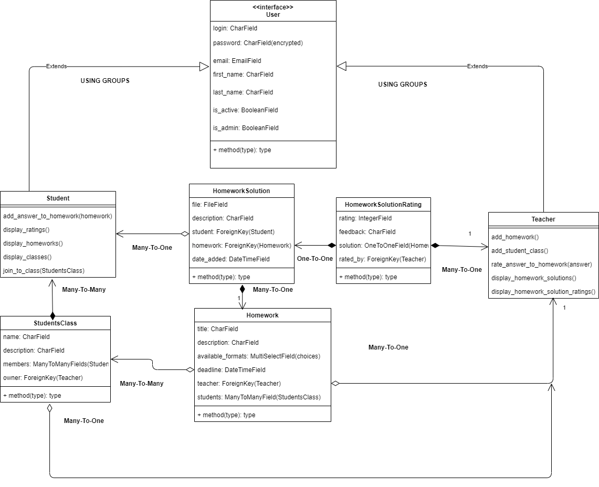

## Diagram przypadków użycia
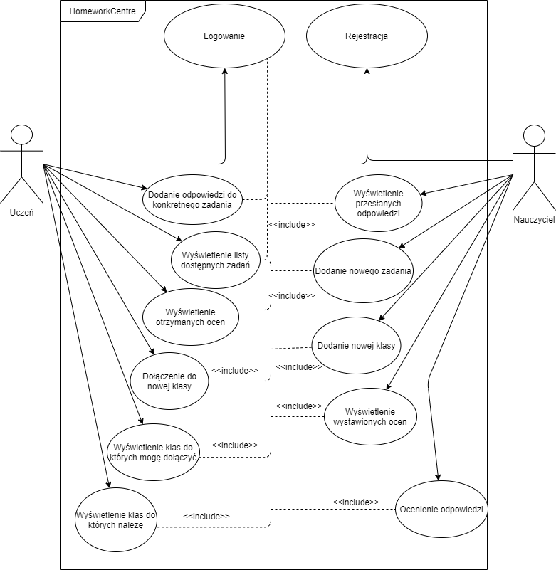

## Prezentacja aplikacji
* [Widok główny](#widok-glowny)
* [Rejestracja i logowanie](#rejestracja)
* [Tworzenie nowej klasy](#tworzenie-nowej-klasy)
* [Tworzenie nowego zadania](#tworzenie-nowego-zadania)
* [Dodawanie odpowiedzi](#dodawanie-odpowiedzi)
* [Ocenianie odpowiedzi](#ocenianie-odpowiedzi)
* [Lista dostępnych zadań](#lista-dostępnych-zadań)
* [Lista nadesłanych odpowiedzi](#lista-nadesłanych-odpowiedzi)
* [Szczegóły oceny](#szczegoly-oceny)
* [Lista klas - student](#lista-klas)

## Widok główny
* Widok główny - nauczyciel
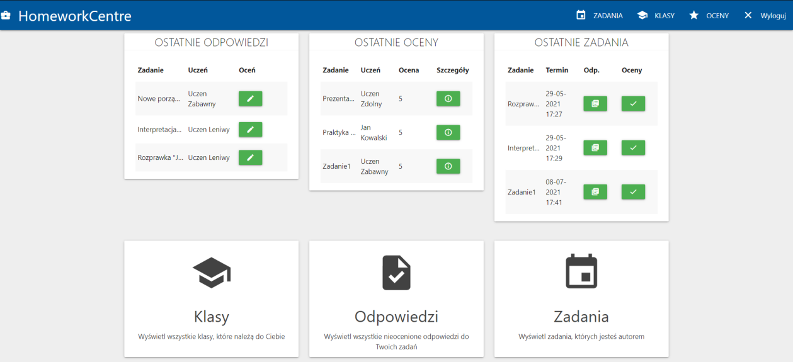
* Widok główny - student
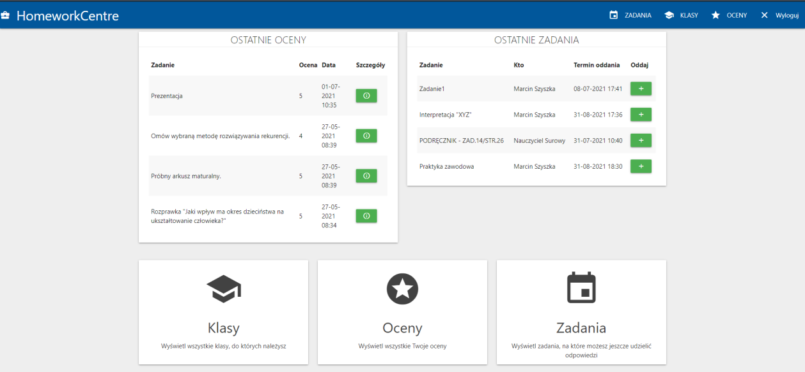

## Rejestracja i logowanie
* Rejestracja
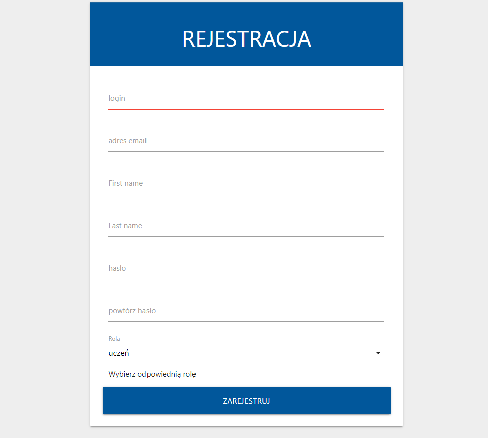
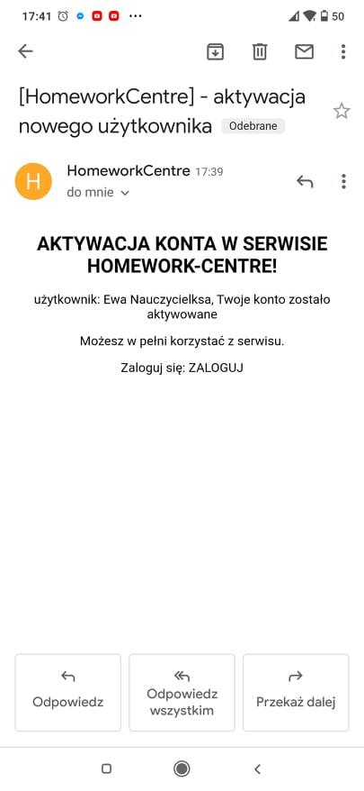
* Logowanie
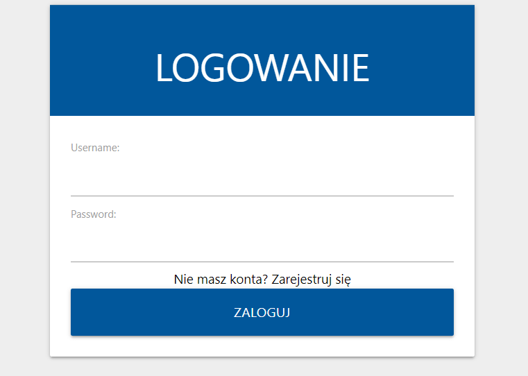

## Tworzenie nowej klasy
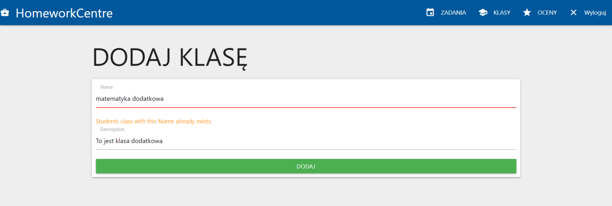

## Tworzenie nowego zadania
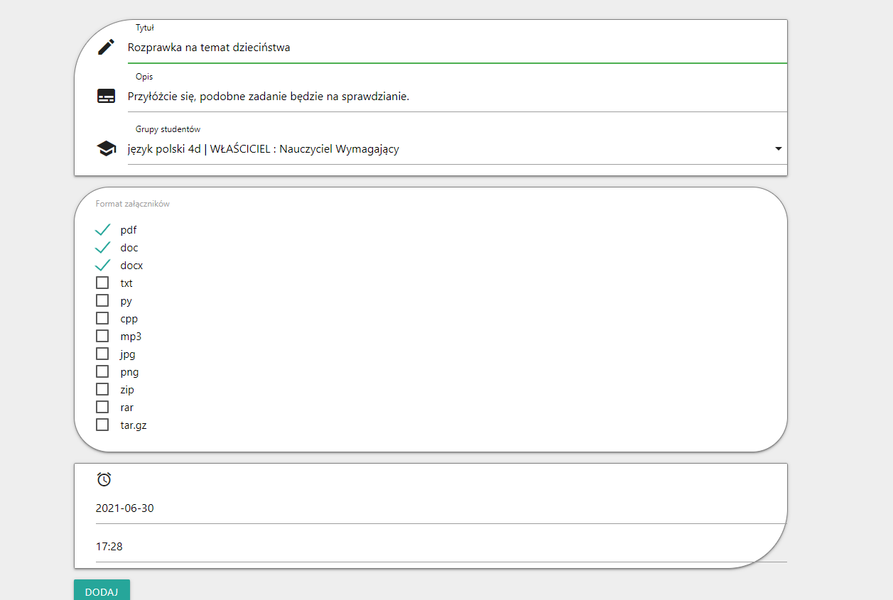

## Dodawanie odpowiedzi
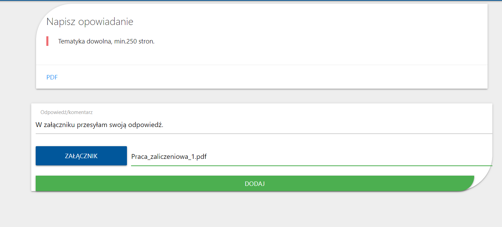

## Ocenianie odpowiedzi
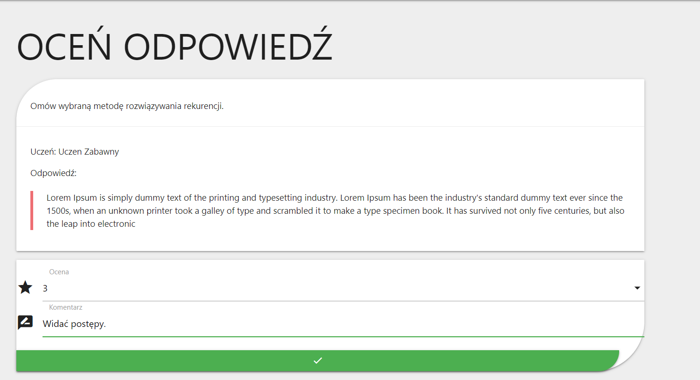

## Lista dostępnych zadań
* Nauczyciel
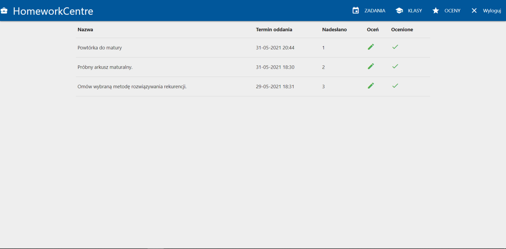
* Student
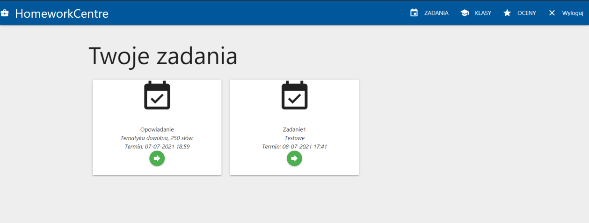

## Lista nadesłanych odpowiedzi
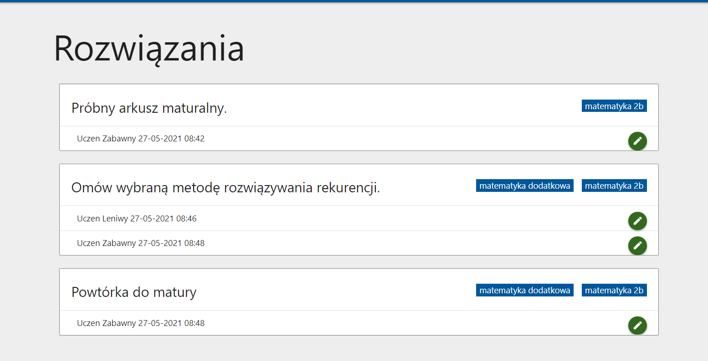

## Szczegóły oceny
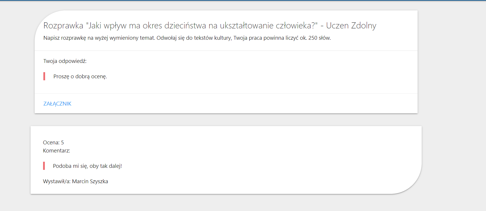

## Lista klas - student


